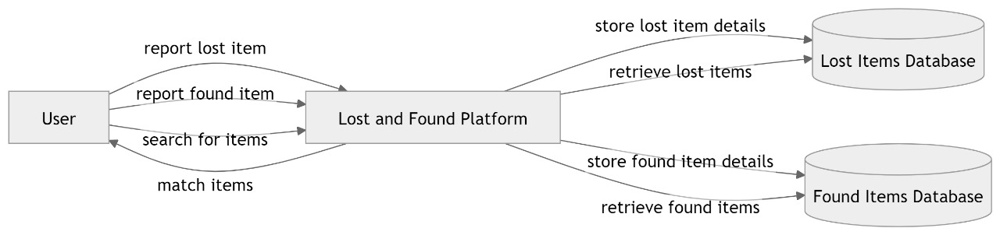
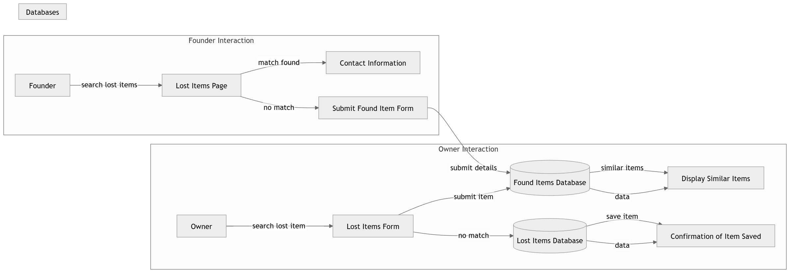
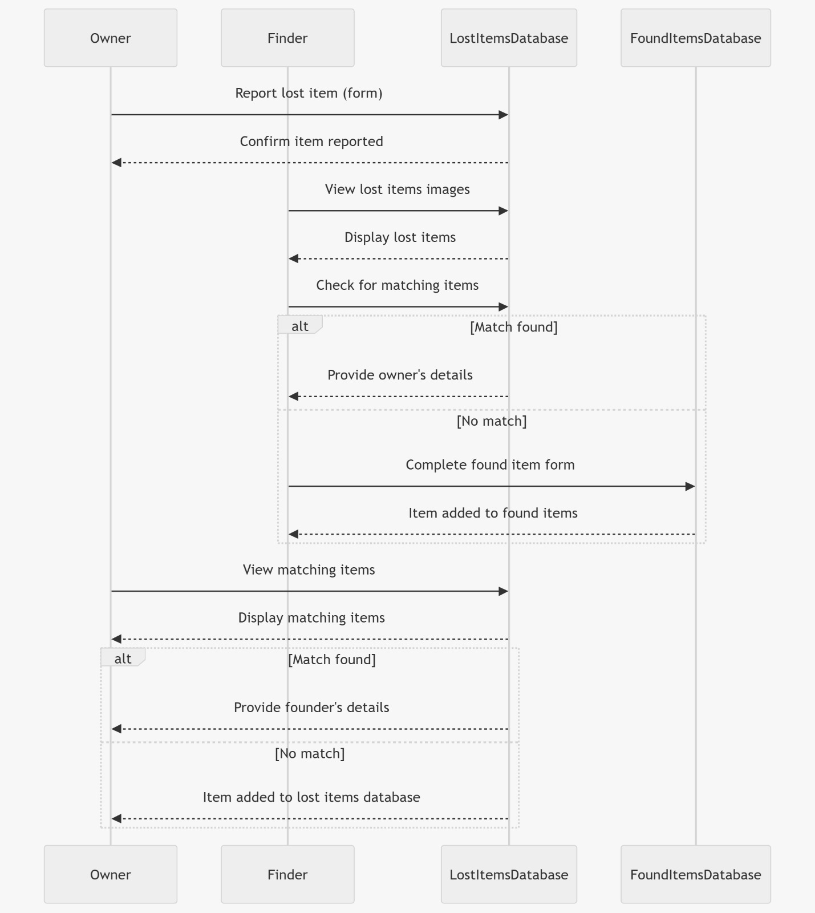
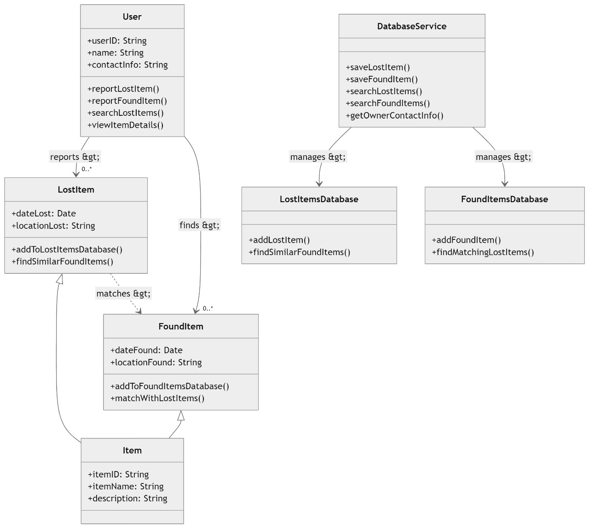
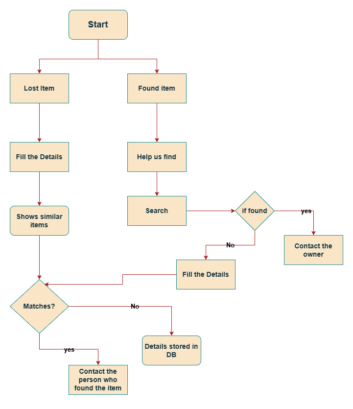
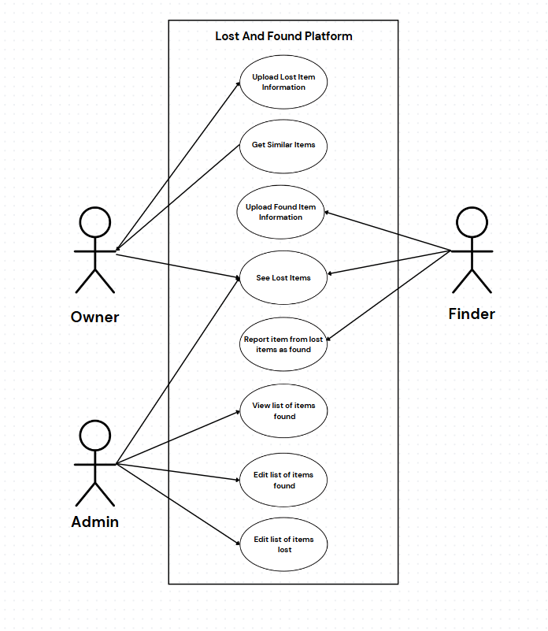

# Lost and Found Platform

This project is a **Lost and Found Platform** where users can report lost and found items, search for items that match their descriptions, and view details of reported items. The platform includes separate databases for lost and found items and provides a user-friendly interface for reporting and searching.

## Table of Contents
- [Overview](#overview)
- [Features](#features)
- [System Design](#system-design)
  - [Data Flow Diagrams](#data-flow-diagrams)
  - [Sequence Diagram](#sequence-diagram)
  - [Class Diagram](#class-diagram)
  - [State Diagram](#state-diagram)
  - [Use Case Diagram](#use-case-diagram)
- [Installation](#installation)
- [Usage](#usage)
- [Technologies Used](#technologies-used)

## Overview
The Lost and Found Platform is designed to help users:
- Report items they have lost or found.
- Search for items to see if someone else has reported finding a similar item.
- Retrieve contact details of the owner if an item match is found.

## Features
- **Report Lost Item**: Users can fill out a form to report a lost item, which is then checked against the Found Items Database. If no match is found, the item is added to the Lost Items Database.
- **Report Found Item**: Users can fill out a form to report a found item, which is checked against the Lost Items Database. If no match is found, the item is added to the Found Items Database.
- **Search Lost Items**: Users can search the Lost Items Database for similar items and view available details.

## System Design

### Data Flow Diagrams
1. **Level 0 DFD**: Shows the high-level flow of information between the user and the platform, interacting with both the Lost and Found Databases.
2. **Level 1 DFD**: Provides a more detailed flow, breaking down processes such as Lost Item Reporting, Found Item Reporting, and Search & Match functionalities.

### Sequence Diagram
The sequence diagram illustrates interactions for reporting lost and found items, checking for matches, and retrieving owner details.

### Class Diagram
The class diagram outlines the core classes and their relationships:
- **User**: Represents the user of the platform.
- **LostItem** and **FoundItem**: Represent items that are reported as lost or found.
- **DatabaseService**: Manages data storage and retrieval between the platform and the Lost/Found Items Databases.
- **LostItemsDatabase** and **FoundItemsDatabase**: Dedicated databases for storing lost and found item reports.

### State Diagram
The state diagram represents the states an item goes through from being reported to finding a match or being stored in the database.

### Use Case Diagram
The use case diagram provides an overview of the platform's core functionalities, showing interactions between the user and the system, including reporting lost items, reporting found items, and searching.

## Usage
- **Report Lost Item**: Users can navigate to the "Report Lost Item" page to submit details of a lost item. The system checks against the Found Items Database for a match. If a match is found, the user can retrieve the finder’s contact information. If no match is found, the item is stored in the Lost Items Database.
- **Report Found Item**: Users can navigate to the "Report Found Item" page to submit details of a found item. The system checks against the Lost Items Database for a match. If a match is found, the finder can retrieve the owner's contact information. If no match is found, the item is stored in the Found Items Database.
- **Search Lost Items**: Users can search for items listed in the Lost Items Database. If a match is found, they can view the contact details of the person who reported the lost item.

## Technologies Used
- **Frontend**: React, HTML, CSS
- **Backend**: Node.js, Express
- **Database**: MongoDB
